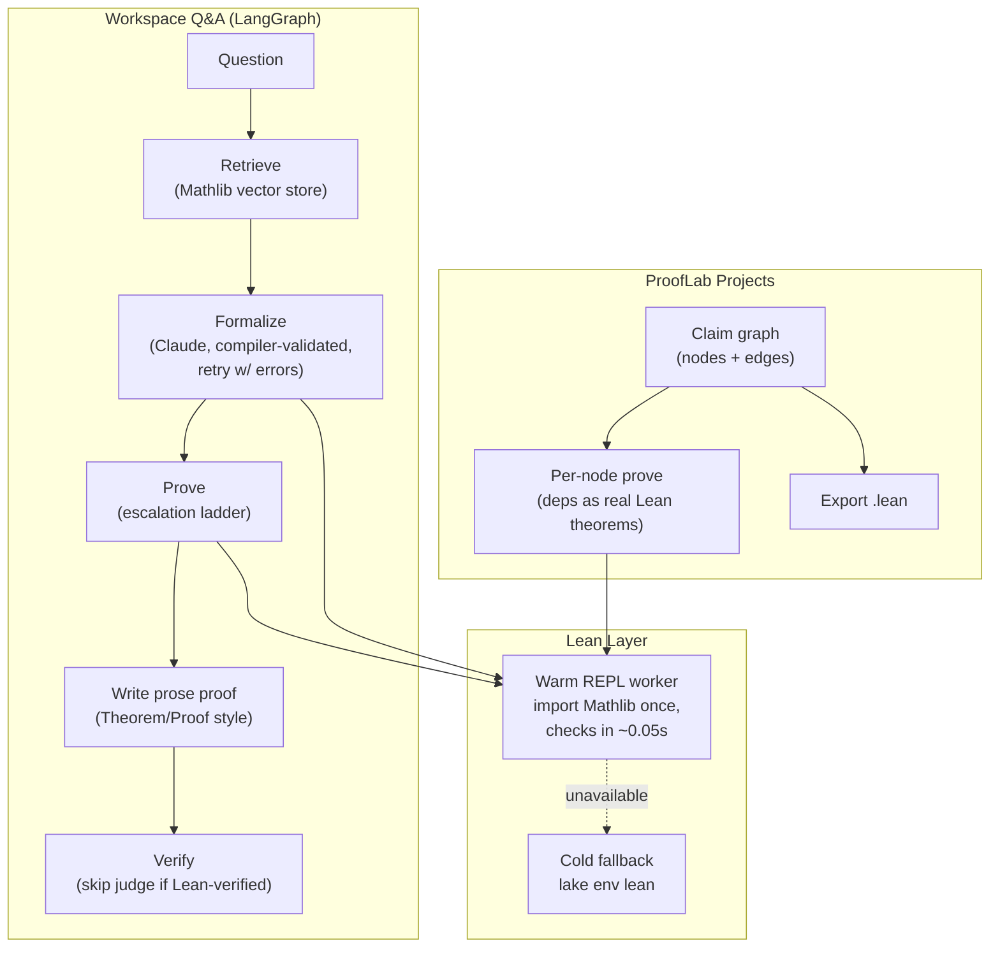

# Axlerate

**An AI math workspace where nothing gets a green badge unless the Lean 4 compiler accepts it.**

Ask a question in plain English and Axlerate formalizes it into Lean, proves it against Mathlib, and writes a textbook-quality prose proof — honestly labeled by how it was verified. Or open **ProofLab** and build proofs as a graph: paste a theorem, watch the AI decompose it into lemma nodes, prove them in parallel, and export the result as a compilable `.lean` file.

The Lean compiler is the only oracle. LLMs draft; Lean decides.

## Table of Contents

- [What It Does](#what-it-does)
- [Architecture](#architecture)
- [The Verification Ladder](#the-verification-ladder)
- [The Warm Lean REPL](#the-warm-lean-repl)
- [ProofLab: Graph-Based Proof Projects](#prooflab-graph-based-proof-projects)
- [Presentation & LaTeX Export](#presentation--latex-export)
- [Models & Cost Tiering](#models--cost-tiering)
- [Repo Layout](#repo-layout)
- [Setup](#setup)
- [Running](#running)
- [API Reference](#api-reference)
- [Honesty Notes & Limitations](#honesty-notes--limitations)
- [Roadmap](#roadmap)

## What It Does

### Workspace (`/workspace`)

Ask a mathematical question. The pipeline:

1. **Retrieve** — semantic search over an index of **all of Mathlib** (218,026 declarations, Chroma + MiniLM embeddings, lexical fallback).
2. **Formalize** — Claude translates the question into a Lean 4 theorem statement. The statement is only trusted if the compiler confirms it elaborates (checked with a `sorry` body); failures retry with the compiler's errors fed back.
3. **Prove** — the escalation ladder (below) tries to close the statement. Every attempt is checked by Lean.
4. **Answer** — a prose proof in real theorem/proof style (never "Step 1 / Step 2"), structured to mirror the verified Lean proof, with the verification tier displayed honestly:
   - 🟢 **Lean verified** — the compiler accepted a proof of the formalized statement.
   - 🟡 **AI reviewed** — no formalization was possible; an LLM judge graded the prose.
   - ⚪ **Unverified** — neither check passed.

### ProofLab (`/proof-lab`)

A graph workspace for complex proofs — claims as draggable nodes, dependencies as edges, the compiler enforcing which arrows carry logical weight. See [ProofLab section](#prooflab-graph-based-proof-projects).

## Architecture



## The Verification Ladder

Every statement climbs the same ladder until something closes it — each rung strictly cheaper than the next:

| Rung | What | Cost |
|---|---|---|
| 1 | Deterministic tactics: `rfl`, `simp`, `omega`, `ext x; simp`, `aesop` | free, ~0.05s each (warm) |
| 2 | **Library search**: Lean's `exact?` scans all of Mathlib for a closing lemma; the concrete suggestion (e.g. `exact Nat.dvd_antisymm h1 h2`) is extracted, re-verified, and stored instead of the search tactic | free, seconds |
| 3 | LLM drafts: Claude proposes tactic blocks, failed attempts + compiler errors fed back each retry | ~cents |
| 4 | **Sketch-then-prove** (`sketcher.py`): Claude writes a proof *skeleton* (`induction`/`have`/`constructor` with `sorry` holes); the REPL reports the exact goal at each hole; holes close independently (10 cheap tactics → Haiku draft → Sonnet drafts); the assembled proof is re-checked whole | ~cents–dimes |

Anti-cheat: `sorry`, `admit`, `axiom`, `native_decide` are forbidden in candidate proofs, and sorry-warnings count as failures.

## The Warm Lean REPL

Cold `lake env lean` runs pay the full `import Mathlib` cost (30–90s) on *every* check. Axlerate keeps one [leanprover-community/repl](https://github.com/leanprover-community/repl) process alive (built in `vendor/repl` against the project toolchain), imports Mathlib **once** at backend boot, and checks every candidate against that environment via `env: 0`:

- proof checks: **~0.01–0.06s** with the entire Mathlib universe in scope
- per-hole checking in the sketcher via proof-state tactic mode (`{"tactic": ..., "proofState": n}`)
- a hung tactic kills and re-warms the worker instead of poisoning later checks
- if the REPL binary is missing, everything silently falls back to cold `lake` runs

Check status: `GET /api/lean/status` → `{"repl_built": true, "warm": true}`.

## ProofLab: Graph-Based Proof Projects

A project is a graph of **claim nodes**. Each node: an English statement, its role label, optionally a compiler-validated Lean statement (`theorem node_<id> ...`), and — once Lean accepts — a verified proof.

**Real composition.** Edges mean "target depends on source." When proving a node, every proved dependency (transitively, topologically ordered) is emitted as a real Lean theorem in the attempt file — the prover can `exact node_abc ...` your lemma and the compiler checks the whole chain.

**Mathematical role labels** with real semantics:

| Label | Semantics |
|---|---|
| **Axiom** | Accepted without proof — enters dependents' Lean context as a genuine `axiom` declaration. Dependents are then *proved relative to your axioms*. |
| **Conjecture** | Default for new claims — an unproven idea. |
| **Lemma** | Helping fact (decomposition children default to this). |
| **Proposition / Theorem / Corollary** | Role labels for the bigger picture. |
| **Converse** (edge type) | Annotation only — dashed purple, symmetric, and **excluded from the proof context**, because a converse is not implied by its original. |

**Per-node AI actions** (in-node hover controls):

- **Prove** — the full ladder, with dependencies in scope; runs in parallel across nodes.
- **Formalize** — English → compiler-validated Lean statement.
- **Decompose** — Claude splits a claim into 2–5 standalone sub-lemmas that become linked child nodes (formalized when they elaborate, with intuitions).
- **Model selector** — Sonnet or Haiku per node (cheap model for easy lemmas).

**Project-level actions** (toolbar):

- **Auto-create** — paste a theorem on the landing page → root node + formalization + AI-proposed lemma graph, one click.
- **Prove all** — proves every unproved node in dependency order.
- **Re-verify** — re-checks every stored proof against the current graph (compiler only, no LLM). Pairs with the **stale cascade**: editing a proved node's statement (or deleting a node/dependency) automatically demotes every transitive dependent, so green badges never lie.
- **Export `.lean`** — a compilable file: axioms declared, proved nodes as docstringed theorems in dependency order, open claims as `sorry` stubs.

**Trust surface.** After a proof succeeds, the verified tactic block is parsed for the Mathlib facts it used (shown as chips) and each dependency edge is marked *referenced in the verified proof* or not. Click any edge to see the fact it carries. Proved nodes get an auto-generated plain-language **intuition** (editable).

**Canvas.** Dotted-grid plane with drag-to-pan, click-to-jump minimap with live viewport tracking, draggable/resizable glass node cards, status-colored borders and edges (green = verified flow into the goal), KaTeX rendering of claims, optional inspector sidebar.

## Presentation & LaTeX Export

Workspace answers ship with a complete LaTeX document, assembled **deterministically** (no LLM writes the `.tex`):

- `amsthm` article: your question as the title, `theorem`/`proof` environments holding the prose
- prose is pure mathematics — Lean/Mathlib identifiers are banned from it by prompt rule
- one italic provenance line ("machine-verified with the Lean 4 proof assistant") instead of embedded code
- compiles under plain `pdfLaTeX`

The LaTeX panel in the workspace: editable source, live approximate preview (KaTeX), **Download .tex**, **Copy**, **Open in Overleaf** (direct form-POST, no account linking).

## Models & Cost Tiering

Configured in `backend/app/engine/llm.py`; requires `ANTHROPIC_API_KEY` in `.env` (falls back to Groq `llama-3.3-70b` without it).

| Tier | Model | Used for |
|---|---|---|
| smart | `claude-sonnet-5` | formalization, proof sketching, escalated drafts, decomposition |
| fast | `claude-haiku-4-5` (3× cheaper) | the YES/NO judge, first-attempt hole closing, node intuitions, per-node choice in ProofLab |

Note: `claude-sonnet-5` rejects non-default sampling parameters — retry diversity comes from failure feedback in prompts, not temperature. Claude responses with adaptive thinking return content as block lists; always go through `llm.text_of()`.

## Repo Layout

```text
Axlerate/
├── backend/
│   ├── app/
│   │   ├── main.py                  ← FastAPI: /api/question, /api/projects/*, /api/lean/status
│   │   ├── engine/
│   │   │   ├── graph_builder.py     ← LangGraph: retrieve → formalize_prove → draft → verify
│   │   │   ├── nodes.py             ← pipeline nodes (Mathlib-grounded, prose rules)
│   │   │   ├── formalizer.py        ← English → Lean statement, compiler-validated, retries
│   │   │   ├── proof_agent.py       ← escalation ladder, exact? library search
│   │   │   ├── sketcher.py          ← sketch-then-prove decomposition (per-hole proof states)
│   │   │   ├── lean_runner.py       ← check_proof/check_statement, forbidden-token guard
│   │   │   ├── lean_repl.py         ← warm REPL worker (import Mathlib once)
│   │   │   ├── proof_projects.py    ← ProofLab graphs: nodes, edges, cascade, export
│   │   │   ├── latexifier.py        ← deterministic .tex assembly
│   │   │   └── llm.py               ← model tiering + text normalization
│   │   └── database/
│   │       ├── vector_store.py      ← shared Chroma client + embeddings
│   │       ├── mathlib_store.py     ← Mathlib vector collection (218k declarations)
│   │       └── mathlib_index.py     ← lexical fallback search
│   └── scripts/index_mathlib.py     ← declaration extractor (all of Mathlib)
├── frontend/                        ← Next.js 16
│   └── app/
│       ├── components/workspace.tsx ← Q&A chat, verification badges, LaTeX panel
│       ├── components/proof-lab.tsx ← project graph canvas
│       └── api/…                    ← proxies to the FastAPI backend
├── proof_lab/                       ← real Lean 4 + Mathlib project (the sandbox)
│   ├── ProofLab/Targets.lean        ← batch-mode targets (legacy CLI loop)
│   ├── targets.json
│   └── projects.json                ← ProofLab graph storage
├── vendor/repl/                     ← Lean REPL build (gitignored; see Setup)
└── axlerate_db/                     ← Chroma db + Mathlib index (gitignored, ~2.4GB)
```

## Setup

### 1. Lean toolchain + Mathlib

```bash
curl -sSfL https://raw.githubusercontent.com/leanprover/elan/master/elan-init.sh | sh -s -- -y
export PATH="$HOME/.elan/bin:$PATH"
cd proof_lab
lake exe cache get   # prebuilt Mathlib (saves ~30 min)
lake build
```

### 2. Warm REPL (strongly recommended — 1000× faster checks)

```bash
git clone --depth 1 --branch v4.29.0 https://github.com/leanprover-community/repl vendor/repl
echo "leanprover/lean4:v4.29.1" > vendor/repl/lean-toolchain   # must match proof_lab/lean-toolchain
cd vendor/repl && PATH="$HOME/.elan/bin:$PATH" lake build
```

### 3. Python backend

```bash
python3 -m venv .venv
.venv/bin/pip install -r backend/requirements.txt
.venv/bin/pip install langchain-anthropic
```

`.env` at repo root:

```bash
GROQ_API_KEY=...        # required (fallback models)
ANTHROPIC_API_KEY=...   # strongly recommended (Claude Sonnet/Haiku tiers)
```

### 4. Mathlib index (one-time, ~1–2h embedding)

```bash
cd backend
../.venv/bin/python scripts/index_mathlib.py
../.venv/bin/python -c "from app.database.mathlib_store import build_store; build_store(force=True)"
```

### 5. Frontend

```bash
cd frontend && npm install
```

## Running

```bash
# backend (REPL warms in ~90s at boot; watch GET /api/lean/status)
cd backend && ../.venv/bin/uvicorn app.main:app --port 8000

# frontend
cd frontend && npm run dev   # http://localhost:3000
```

Legacy batch CLI (proves `targets.json` entries, writes proofs back into `Targets.lean`):

```bash
cd backend && ../.venv/bin/python -m app.engine.proof_agent [--target <id>]
```

## API Reference

| Endpoint | Description |
|---|---|
| `POST /api/question` | Q&A pipeline → `{proof, verification, lean_statement, lean_proof, latex_document}` |
| `GET /api/lean/status` | `{repl_built, warm}` |
| `GET/POST /api/projects` | list / create projects |
| `POST /api/projects/auto` | `{name, statement_en}` → auto-generated claim graph |
| `GET/DELETE /api/projects/{id}` | fetch (poll during proving) / delete |
| `POST .../nodes`, `PATCH/DELETE .../nodes/{nid}` | node CRUD (statement, position, size, kind, model, intuition) |
| `POST .../edges`, `POST .../edges/delete` | edges (`kind`: `uses` \| `converse`) |
| `POST .../nodes/{nid}/formalize` | English → validated Lean statement |
| `POST .../nodes/{nid}/prove` | background prove (parallel across nodes) |
| `POST .../nodes/{nid}/decompose` | AI sub-lemma children |
| `POST .../prove_all` | prove everything, dependency order |
| `POST .../reverify` | re-check all stored proofs (compiler only) |
| `GET .../export` | `{filename, content}` — compilable `.lean` |

## Honesty Notes & Limitations

- **Formalization is the weak link.** The compiler guarantees the Lean statement is *provable as stated*, not that it *faithfully captures your question*. The Lean statement is always displayed — read it. A round-trip faithfulness check is the top roadmap item.
- Nodes proved via axiom dependencies are proved **relative to those axioms** (the graph shows the dependency; a dedicated badge is planned).
- Edge "referenced in the verified proof" flags are literal: tactics like `simp` can use a lemma without naming it, so *not referenced* ≠ *not needed*.
- One REPL worker serializes compiles; heavy parallel proving queues at the compiler (still fast warm).
- ProofLab storage is a JSON file — fine for local use, not multi-user.

## Roadmap

1. Formalization round-trip check (Lean → English → "is this what you meant?")
2. Counterexample search (`plausible`) before burning proof attempts on false claims
3. "Proved relative to axioms" badge
4. Streaming proof progress (replace polling)
5. Proof replay — step-by-step natural-language walkthrough of verified proofs
