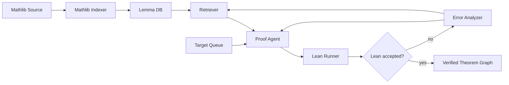

# Axlerate

An AI proof agent that picks an open `sorry` from a Lean target file, drafts a proof, and asks Lean to verify it. The Lean compiler is the oracle — nothing is "accepted" unless Lean accepts it.

## Table of Contents

- [Architecture](#architecture)
- [How the Loop Works](#how-the-loop-works)
- [Repo Layout](#repo-layout)
- [Current Targets](#current-targets)
- [Setup](#setup-one-time-windows--powershell)
- [Lean / Mathlib Commands](#lean--mathlib-commands)
- [Editing the Targets File](#editing-the-targets-file)
- [Status](#status)

## Architecture



## How the Loop Works

1. **Target Queue** pulls an unproven theorem from `proof_lab/ProofLab/Targets.lean` (one of the `sorry`s).
2. **Retriever** looks up relevant lemmas from the **Lemma DB** (Mathlib indexed into a vector store).
3. **Proof Agent** drafts a Lean tactic block to replace the `sorry`.
4. **Lean Runner** writes the candidate proof into the file and runs `lake build` on it.
5. **Lean accepted?** if Lean's exit code is `0`, success → add to the Verified Theorem Graph.
6. **Error Analyzer** if Lean rejected it, parse the goal state and error, feed it back to the Retriever and Agent, retry.

`proof_lab/` is the sandbox the agent writes into. It's a real Lean 4 + Mathlib project — nothing fake. `Targets.lean` currently holds a few small `sorry`s as the agent's first exercises.

## Repo Layout

```text
Axlerate/
├── readme.md                 ← this file
└── proof_lab/                ← Lean 4 sandbox the agent works in
    ├── lakefile.toml         ← Lake config, pins Mathlib v4.29.1
    ├── lean-toolchain        ← Lean version pin: leanprover/lean4:v4.29.1
    ├── lake-manifest.json    ← resolved dependency lockfile
    ├── ProofLab.lean         ← library root, imports the modules below
    └── ProofLab/
        ├── Basic.lean        ← empty placeholder for future helpers
        └── Targets.lean      ← the sorry's the agent tries to close
```

## Current Targets

Stubbed `sorry`s in `proof_lab/ProofLab/Targets.lean`:

| # | Theorem                 | Statement                  |
| - | ----------------------- | -------------------------- |
| 1 | `target_nat_add_zero`   | `∀ n : Nat, n + 0 = n`     |
| 2 | `target_nat_zero_add`   | `∀ n : Nat, 0 + n = n`     |
| 3 | `target_set_inter_comm` | `A ∩ B = B ∩ A` for sets   |
| 4 | `target_set_union_comm` | `A ∪ B = B ∪ A` for sets   |

These are toy warm-up targets, not real Mathlib gap-closing work. The point is to get the agent's loop running end-to-end.

## Setup (one-time, Windows / PowerShell)

Install `elan` (the Lean version manager):

```powershell
iwr -useb https://raw.githubusercontent.com/leanprover/elan/master/elan-init.ps1 | iex
```

Add `elan` / `lean` / `lake` to `PATH` for the current shell:

```powershell
$env:Path += ";$env:USERPROFILE\.elan\bin"
```

Verify the install:

```powershell
lean --version
lake --version
elan --version
```

## Lean / Mathlib Commands

All commands run from inside `proof_lab/`:

```powershell
cd proof_lab
$env:Path += ";$env:USERPROFILE\.elan\bin"
```

### First-time Mathlib build

Pull the prebuilt Mathlib cache (saves ~10–30 minutes of compilation):

```powershell
lake exe cache get
lake build
```

### Day-to-day

```powershell
lake build                              # build everything
lake build ProofLab.Targets             # build just the Targets module
lake update                             # re-resolve dependencies after editing lakefile.toml
lake exe cache get                      # pull latest cached Mathlib build (run after lake update)
lake clean                              # remove build artifacts
lake env lean ProofLab/Targets.lean     # run Lean on a single file
```

### Quick "is this proof valid?" check

The agent does this in code; you can run it manually:

```powershell
lake env lean ProofLab/Targets.lean
```

- Exit code `0` → Lean accepted everything.
- Exit code `≠ 0` → at least one error; parse `stdout` / `stderr` for the goal state.

## Editing the Targets File

Open `proof_lab/ProofLab/Targets.lean`. Each `sorry` is a slot the agent can replace with a real proof. To add a new target, append another `theorem ... := by sorry` block inside the `namespace ProofLab` block.

## Status

| Component                  | State                                       |
| -------------------------- | ------------------------------------------- |
| `proof_lab/` Lean sandbox  | ✅ initialized, builds, 4 sorry targets     |
| Mathlib Indexer            | ⬜ not built yet                            |
| Lemma DB (vector store)    | ⬜ not built yet                            |
| Retriever                  | ⬜ not built yet                            |
| Proof Agent                | ⬜ not built yet                            |
| Lean Runner                | ⬜ not built yet                            |
| Error Analyzer             | ⬜ not built yet                            |
| Verified Theorem Graph     | ⬜ not built yet                            |

**Next milestone:** smallest possible end-to-end loop — agent reads `target_nat_add_zero`, drafts `by simp` or `by rfl`, Lean verifies, mark as solved.
